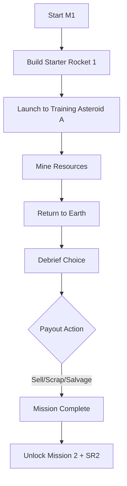
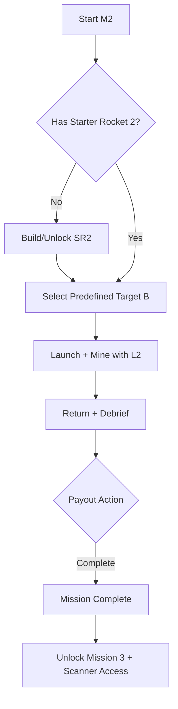
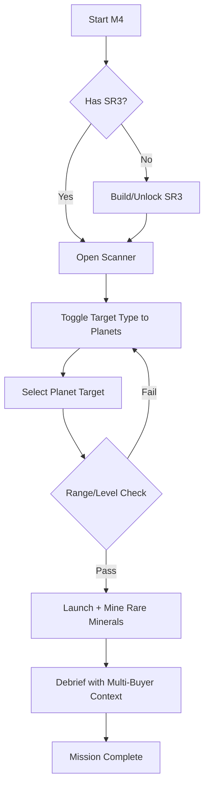
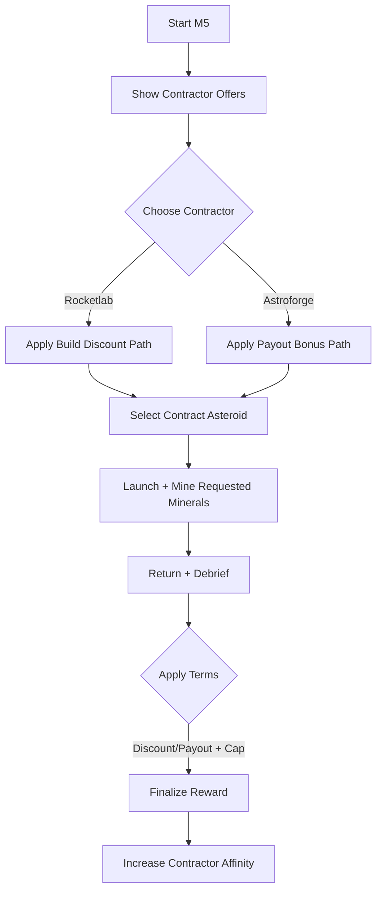

# Mission Flowchart Diagrams

These flowcharts visualize the mission progression described in @doc/specs/mission-system-specification.

## Mission 1 (M1) - Linear Tutorial Flow



## Mission 2 (M2) - Upgrade Decision Path



## Mission 3 (M3) - Scanner Unlock and Target Selection

```mermaid
flowchart TD
  A[Start M3] --> B{Scanner Station Built?}
  B -->|No| C[Build Scanner Station (2B F)]
  C --> D[Run First Scan]
  B -->|Yes| D
  D --> E[View 5 Asteroids]
  E --> F{Choose Reachable Target}
  F -->|Blocked| E
  F -->|Valid| G[Launch + Mine + Return]
  G --> H[Debrief Complete]
  H --> I[Unlock Mission 4 + SR3]
```

## Mission 4 (M4) - Planet Toggle and Long-Range Exploration



## Mission 5 (M5) - Contractor Choice and Effects



## Notes

- M1 is intentionally linear for onboarding.
- M2 introduces upgrade dependency before launch.
- M3 introduces first meaningful target-choice branch.
- M4 introduces target-type toggle and hard range gating.
- M5 introduces strategic contractor branching with capped outcomes.
