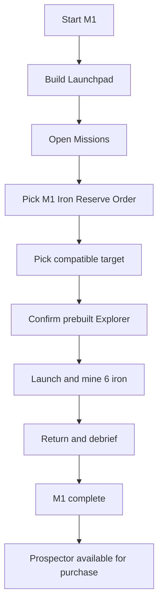
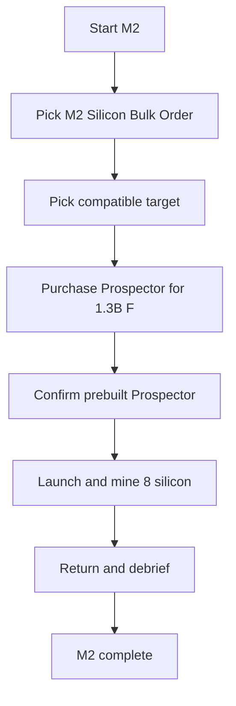

# Mission Flowchart Diagrams

Current canonical flowcharts for active onboarding. M3 and anything after it are intentionally omitted until the new M3 direction is written.

## Mission 1 (M1)

## Mission 2 (M2)

## Boundary

Only M1 and M2 are represented here. M3 waits for the new direction.
