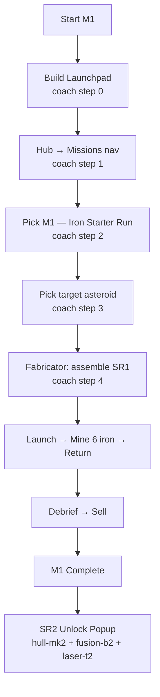
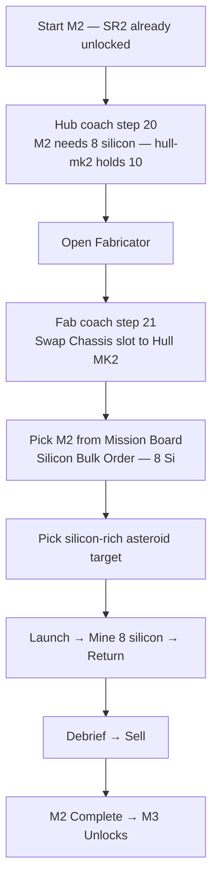
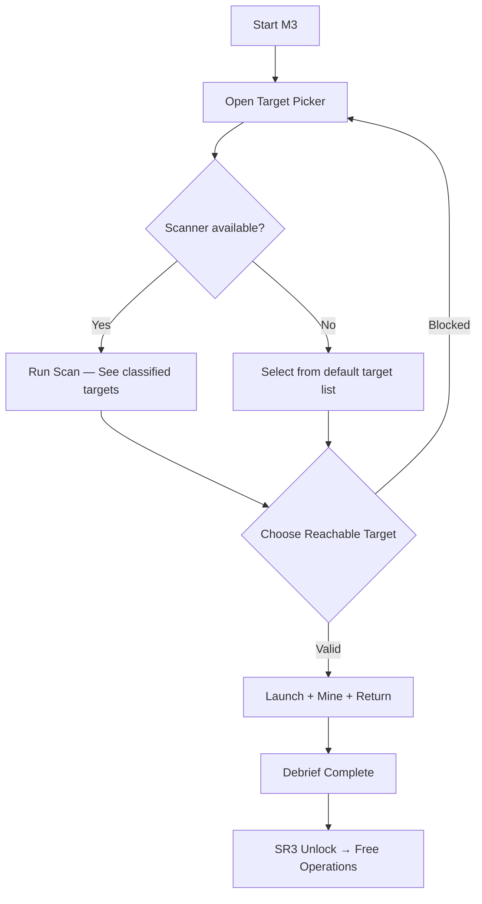

# Mission Flowchart Diagrams

> Canonical flowcharts for M1–M3 mission decision paths.
> M4 and M5 sections were removed — they documented features that no longer exist.
> Source of truth: @doc/Landnam-docs_specs_missions_mission-flowchart-diagrams in Knowns.

## Mission 1 (M1) - Linear Tutorial Flow

## Mission 2 (M2) - Rocket Fabricator Tutorial

> M2 is a direct repeat of the M1 mining loop with a higher cargo requirement that forces
> the player to use the Fabricator to upgrade their hull. No Control Station, no TESS,
> no Satellite.

### M2 Mechanical Gate
Hull MK1 cargo = 6 units. M2 requires 8 silicon. The player must open the Fabricator
and swap to Hull MK2 (cargo 10) before they can fill the order.

## Mission 3 (M3) - Exoplanet Target Selection

> Scanner Station purchase is possible from M3 onward but is **not** a hard gate before
> launch. Players may already have it built, or may build it during target selection.

## Notes

- M1 is intentionally linear for onboarding.
- M2 teaches the Fabricator: cargo upgrade is the only gate.
- M3 introduces target-choice and optional scanner usage — no hard scanner gate.
- There is no authored M4 or M5. Free Operations follows M3 directly.
